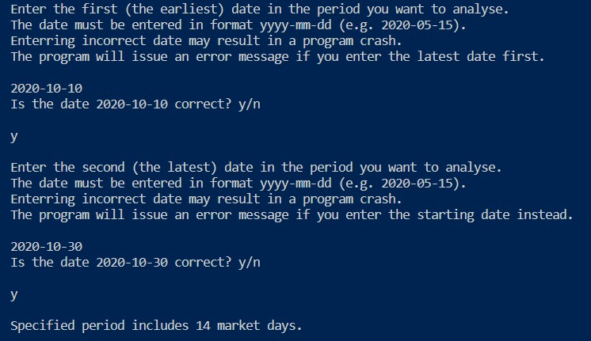

# Equity Stock Pulse Check Project

## Introduction

Welcome to the "Equity Stock Pulse Check" Project. This CLI-based program extracts current share price from yfinance external sourse. It also asks the user to provide the day of the equity purchase, obtains historical share price and calculates ROI (Return on Investment). As an example to work with, I took Ilika Technologies Ltd (the author was an employee there for many years and is familiar with current and historical trends). Based on ROI, the program suggests if it would be profitable to sell your shares today. The programme will also prompt you to enter starting and final dates of the period of time (not necessarily the most recent), run linear regression analysis and conclude if the market was bearish or bullish. It will also check an applicability of the linear model and warn the user if the results can be trusted.

## How to use

1. Hit Enter when asked.

The program will immediately show the most recent available share price. I took the value, corresponding to closure of the latest trading session.

2. Enter the date of the equity acquisition when prompted.

The program will print an extra message from the external yfinance library, historical share price and return on investment (ROI) if you were to decide selling today.

3. Enter the starting and ending dates of the period you want to analise.

The dates must be provided in the required format (also in step 2). The program will generate an error message if you provide beginning and ending days in a different order.

If the dates enterred in a correct order, the program will run linear regression analysis and print outcome.

4. Choose if you want to quit or continue.

## Future features

1. Add possibility to select various tickers (other stock portfolia).
2. Add possibility to select share price form "open", "high", "low" and "closure" for more accurate short-term data analysis.
3. Validate date format.
4. Add possibility to compile imported data and analysis results into a single spreadsheet (e.g. *.xlsx).

## Data structure

In this project, I used a set of defined functions, each with unique task to perform and single return. The flow runs through several if-else structures, selecting appropriate outcome. The functions are assembled in the main() function, which is called at the end of code. The program uses several external libraries.

The program creates *.csv files in working directory and use them to store imported data.

## Testing

The code was manually tested by providing different dates and monitoring if the generated outcome is appropriate.

The code was supplied to PEP8 validator. The validator indicates few issues with the code which the author is completely aware of:

Some strings in printed messages are two long. I supplied enough of "new line" characters to prevent broken words and keep text tidy.

## Remaining bugs

The main bug the author could not fix in the context of this work is date format validation. There is an error message generator only testing the validity of time interval (period, e.g. negative or 0 number of business days). It seems that used library (yfinance) strictly adheres to its own format YYYY-MM-DD and generates an error if it is wrong. The warning message was added, but the program tends to break if the date format is incorrect. One way to fix the bug is to use html interface with py-script and input type = "date", where the framework would prevent enterring anything but date.

### Last minute fix (temporary) of the bug

As the last minute fix, the author has introduced a while loops which allow to double check and confirm the data (and re-enter if nesessary).

## Plagiarism

The author confirms that the project represents an origional work.

## Development and deployment

The code was written using desctop version of VS Code. The following steps were needed to enable VS Code run on a desctop to be synchronised with GitHub repo:

1. Create online GitHub project repository.
2. Install desctop VS  Code
3. In GitHub (online version, repository page) select Code and then select Open with GitHub Desctop option.
4. Install GitHub Desctop if not already installed.
5. Create a clone of your GitHub repository on your PC.
6. Open clone repo. Select open with desctop VS Code option.
7. Use the same git add, commit and push command in the Terminal to commit and push changes.

Prior to importing modules, external libraries had to be installed. This was performed by running pip3 install "library_name" command.

The code was deployed om Heroku platform, following instructions provided in CI scope video. The deployed application can be found here:
https://equity-stock-pulse-check-84925993fa4c.herokuapp.com/

The deployment required the following steps:

1. Create new app on Heroku.
2. Set buildpacks (Python and NodeJS).
3. Set PORT to 8000 in the config var section.
4. Link Heroku with GitHub repo.
5. Deploy (Automatic deployment option was selected).
        
## Credits

Deployment terminal and project template were provided by Code Institute.

## Bugs and issues fixed after the submission

